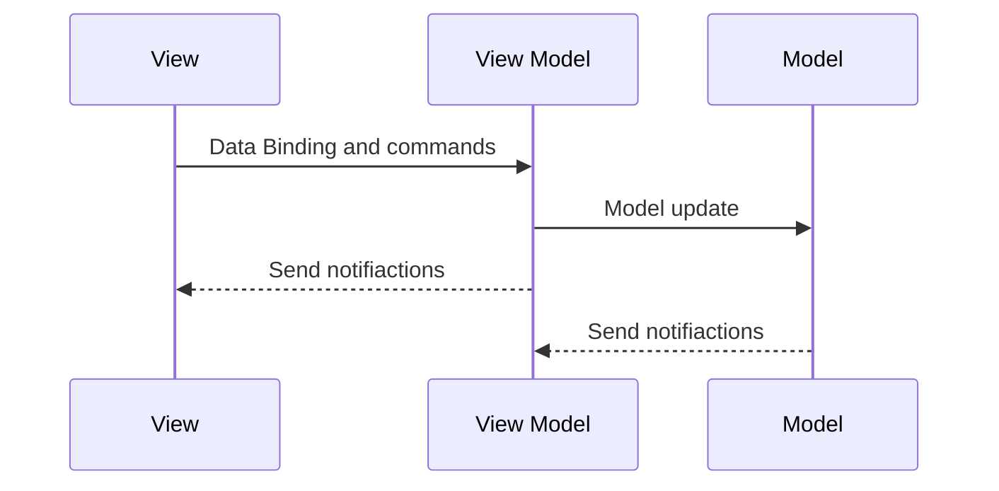
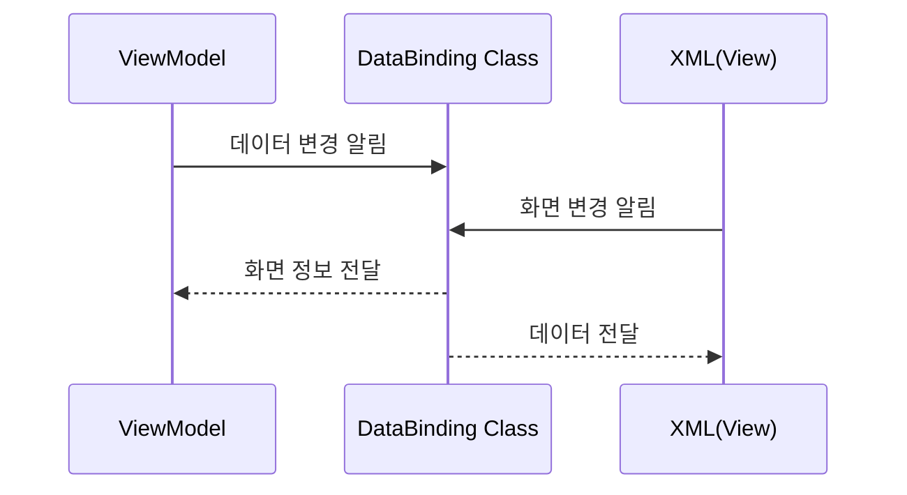

MVVM에서의 View와 ViewModel
=
- View는 화면에 표시되는 레이아웃에 대해 관여합니다. 기본적으로 비지니스 모델에서 베제하지만 UI에 관련된 로직들을 수행합니다.
- ViewModel은 View에 연결할 데이터와 명령으로 구현되어있으며 변경 알림을 통해서 뷰에게 상태 변화를 전달합니다. 
  전달받은 상태변화를 화면에 적용할지는 View에서 결정하게 합니다
  명령은 UI를 통해서 동작하도록 합니다

View와 ViewModel의 관계
=

- ViewModel은 Model은 알지만 View는 알지 못합니다.
- View는 ViewModel은 알지만 Model을 알 수 없습니다
- View는 ViewModel을 옵저빙 하고 있다가 상태가 변화하면 화면을 갱신해야 합니다.

DataBinding : View와 ViewModel의 독립
=

- DataBinding은 View와 ViewModel 사이의 데이터와 명령을 연결해주어 각자의 존재를 명확하게 알지 못해도 다양한 인터랙션을 할 수 있게 도와주는 역할을 합니다.
- DataBinding을 통해서 View와 ViewModel은 독립성을 더 높힐 수 있습니다

<!--stackedit_data:
eyJoaXN0b3J5IjpbMTI0NjU2MjIzNV19
-->
